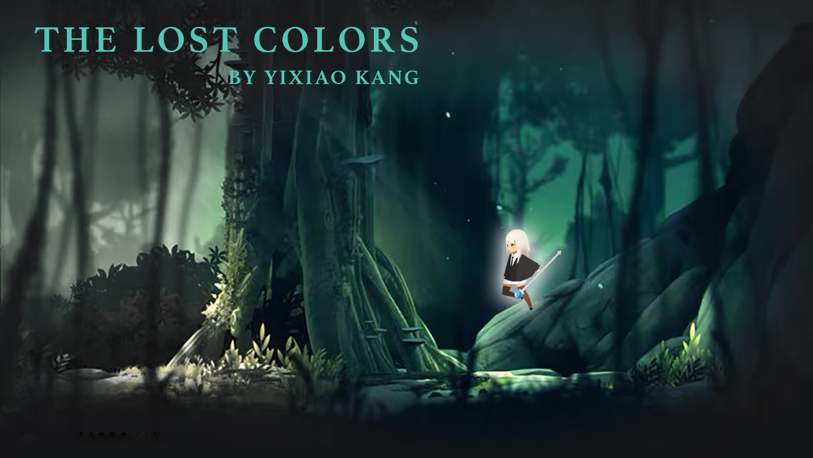
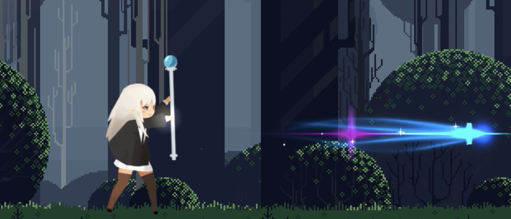
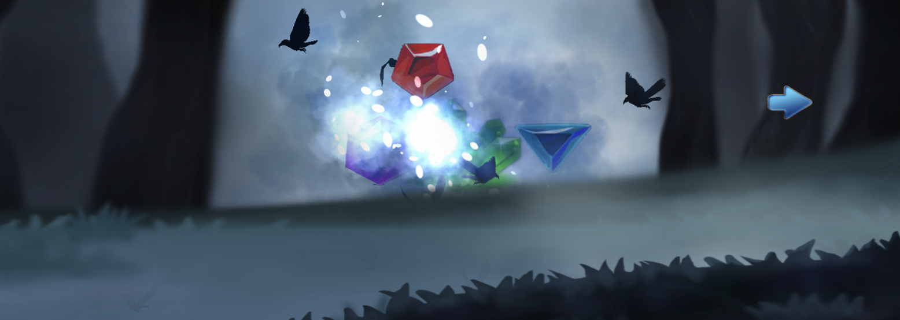
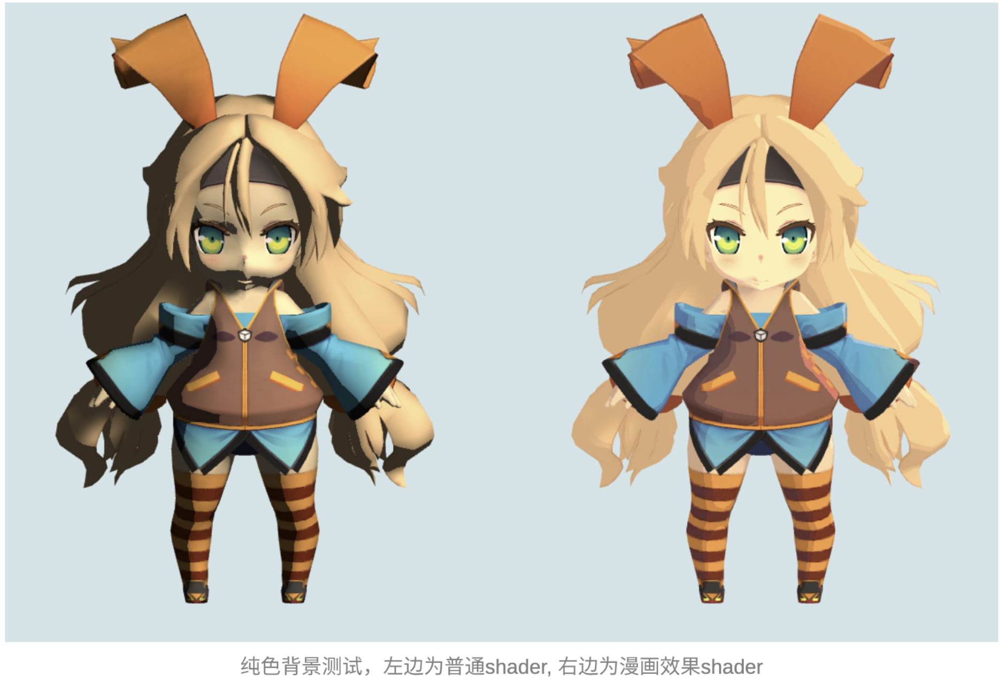
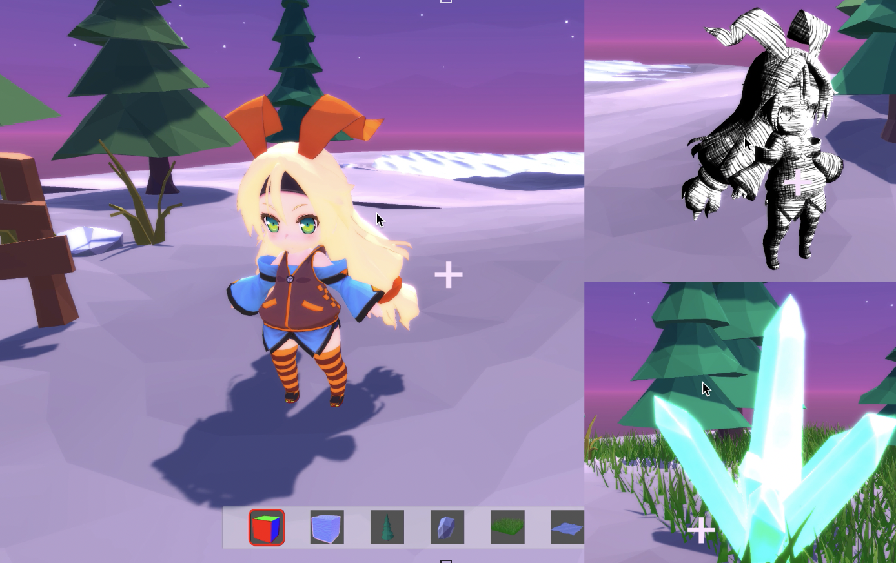

# Game-Development

please find all source code, files, Executable files in :[release](https://github.com/echo-xiao9/Game-Development/releases/tag/v1.0.0)

## hw3 The lost colors

[game design](https://github.com/echo-xiao9/Game-Development/tree/main/hw3_the_lost_color/518431910002_KangYixiao_hw3_poster)

[development report](https://github.com/echo-xiao9/Game-Development/blob/main/hw3_the_lost_color/518431910002_KangYixiao_hw3_code/The_Lost_Colors_%E4%BD%9C%E4%B8%9A%E6%8A%A5%E5%91%8A.pdf)

[instructions for the game](https://github.com/echo-xiao9/Game-Development/blob/main/hw3_the_lost_color/518431910002_KangYixiao_hw3_code/The_Lost_Colors_%E6%93%8D%E4%BD%9C%E6%8C%87%E5%8D%97.pdf)

## hw5 custom shader

[documentation](https://github.com/echo-xiao9/Game-Development/blob/main/hw5_custom_shader/518431910002_Kangyixiao_hw5/hw5_%E8%87%AA%E5%AE%9A%E4%B9%89shader.pdf)

Unity shader: cartoon, sketch, bloom，the depth of field effects. 

